# Whanos 🐋

This project allow to build any project in all the supported languages supported (befunge, c, java, javascript and python) by running them in a Docker.  
We provide custom images so you can use them to build your project (whanos-c, whanos-java, whanos-javascript, whanos-python).

Even more ! With a simple file called `whanos.yml` you can define how to deploy your project, and we'll use it to deploy it using Docker and Kubernetes.
Here's an example of a `whanos.yml` file:

```yaml
deployment:
  replicas: 3
  resources:
    limits:
      memory: "128M"
    requests:
      memory: "64M"
  ports:
    - 3000
```

This project use Ansible to deploy the base of the project, allow project management using Jenkins and any git repository. And finally, we use Kubernetes to deploy the project.  
(In our case we'll use Azure Kubernetes Service for the deployment and Azure Container Registry for the images)

> [!NOTE]
> Warning Epitech students, stealing code you may get you a -42 ;)  
> You've been warned.

## How to setup the project for yourself ?

### Requirements

You'll need a machine to deploy the project on. The machine should be running Debian 12 (Bookworm).  
In our case we'll use a virtual machine running on Azure. But you can use any provider you want (even your own machine !).

For the docker registry, you can self-host it (using the `docker-registry` image) or use a cloud provider (like Azure Container Registry as we'll do).

> [!NOTE]
> You'll need to have a correct url pointing to your registry.  
> Also a login and password to push images to the registry. (see the `docker login` command)

Finally, we'll need a kubernetes provider. Again, you can use any provider you want. In our case we'll use Azure Kubernetes Service.  
Make sure that you can get the `kubeconfig` file from the provider. (usually stored in `~/.kube/config`)

### Usage

We're providing you a tutorial to setup the project on Azure. You're on your own if you want to use another provider.
If you don't want to use Azure, you can skip the first part and go directly to the [Ansible part](#configure-the-project).

First you need to login to the Azure Portal [here](https://portal.azure.com/).

Now create a new resource group (you can go [here](https://portal.azure.com/#browse/resourcegroups) to create a new one).  
Click on "Create".

You should see a form like this:
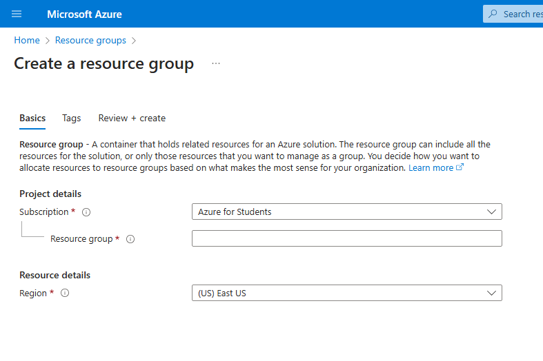

On our side we use the "Azure for Students" subscription. Ans we'll name the groupe `whanos-rg` and we'll use the `westeurope` region.  
But you can use any subscription, name and region you want ! (just remember the name of the resource group)

#### Virtual Machine

Now we'll create a new virtual machine.  
Browsing to your resource group, click on "Create" and search for "Virtual Machine".

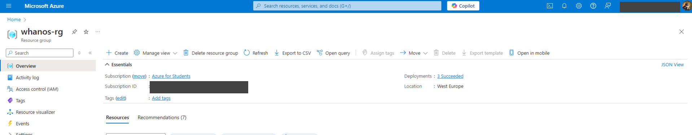

You should see a form like this:

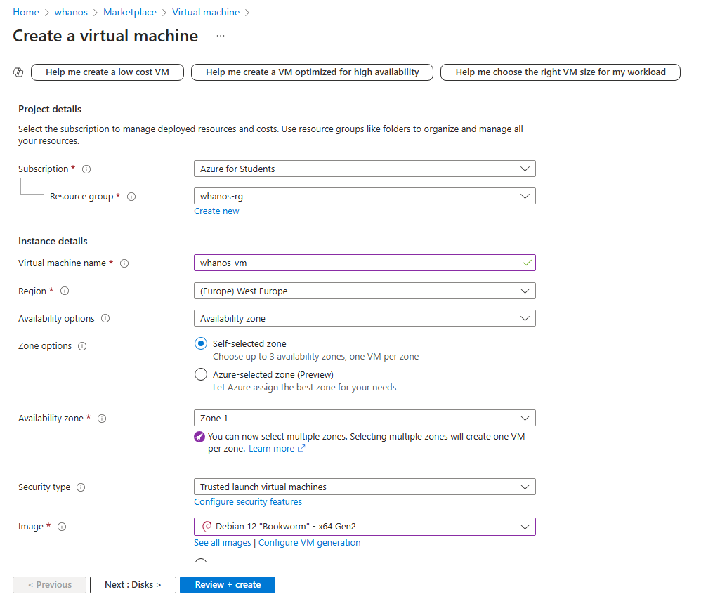

You can of course use name your VM as you want.  
On this screen the only important thing is the the "Resource group" and the Image used (make sure to use Debian 12).

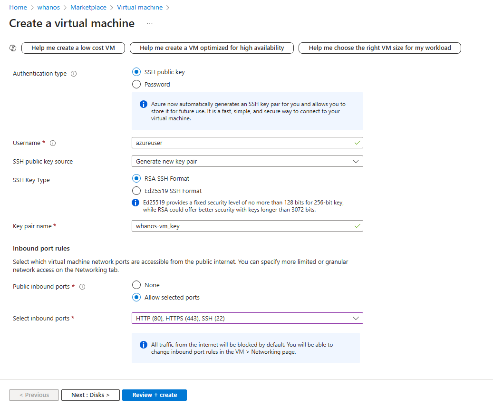

Use ssh for the authentication type. We'll use it to connect to the VM. (Note that it'll be stored in the group `whanos-rg`).  
And open the port 22, so we can connect to the VM. And the port 80, so we can access the Jenkins server.

Now you can click on "Review + create" and then "Create" !  
(also don't forget to get the public)

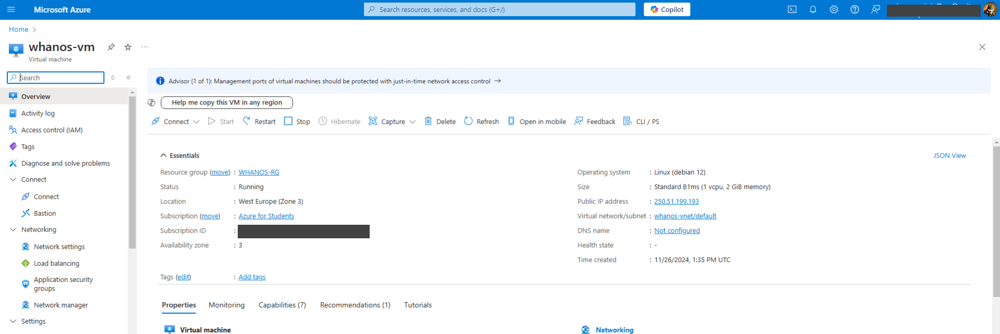

On this screen you can see the public IP of the VM, note it down.

#### ACS (Azure Container Registry)

For the registry, you can use the Azure Container Registry.
You'll need to create a new recource group (if you don't have one already) and then create a new registry.

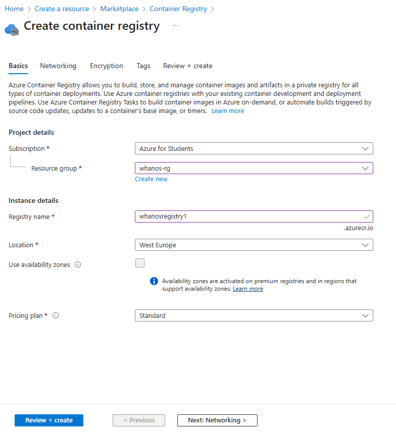

Now you have a new registry, you can use it to store your images !  
You need now to get the login and password to push images to the registry.

We'll generate a them using the Azure CLI and the Azure Cloud Shell.  
You can access the console by clicking here on the bash icon situated on the top bar of the portal :

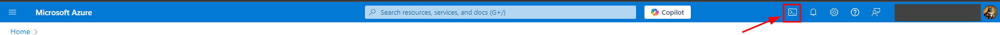

Select your shell as Bash. And enter the following command:

```bash
az acr token create --name REGISTRY_USERNAME --registry REGISTRY_NAME --repository * content/write content/read --output json
```

Replace `REGISTRY_USERNAME` by the username you want to use to push images to the registry.
And `REGISTRY_NAME` by the name of the registry you created.

In our case we'll use `whanos` as the username and `whanosregistry1` as the registry name.

After running it you should get a JSON looking like this:

```json
{
{
  "creationDate": "//",
  "credentials": {
    "certificates": null,
    "passwords": [
      {
        "creationTime": "//",
        "expiry": null,
        "name": "password1",
        "value": "THE SUPER PASSWORD THAT HAVE BEEN GENERATED"
      },
      {
        "creationTime": "//",
        "expiry": null,
        "name": "password2",
        "value": "THE SUPER PASSWORD2 THAT HAVE BEEN GENERATED"
      }
    ],
    "username": "REGISTRY_NAME"
  },
  "id": "//",
  "name": "REGISTRY_NAME",
  "provisioningState": "Succeeded",
  "resourceGroup": "whanos-rg",
  "scopeMapId": "//",
  "status": "enabled",
  "systemData": {
    "createdAt": "//",
    "createdBy": "//",
    "createdByType": "User",
    "lastModifiedAt": "//",
    "lastModifiedBy": "//",
    "lastModifiedByType": "User"
  },
  "type": "Microsoft.ContainerRegistry/registries/tokens"
}
```

Store the username and the password somewhere safe, we'll need them later (only one of the passwords is needed).

Also you'll need to get the URL of the registry. You can find it in the "Overview" tab of the registry.

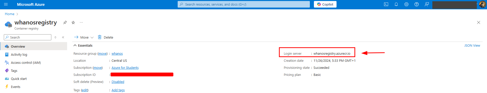

#### AKS (Azure Kubernetes Service)

As before, you'll need to create a kubernetes cluster in the same resource group as the registry.  
You can almost leave the default values, just set a name (we'll use "k8s") for the cluster and the proper group.
****
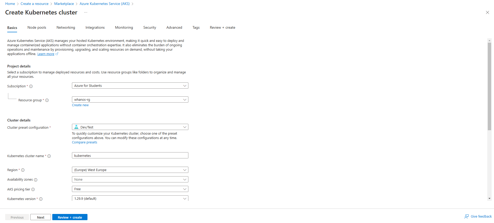

You'll need to edit the node pool to have a constant number of nodes (we'll use 2 nodes).  
Go in the "Node pools" tab and click on the default node pool (here `agentpool`).

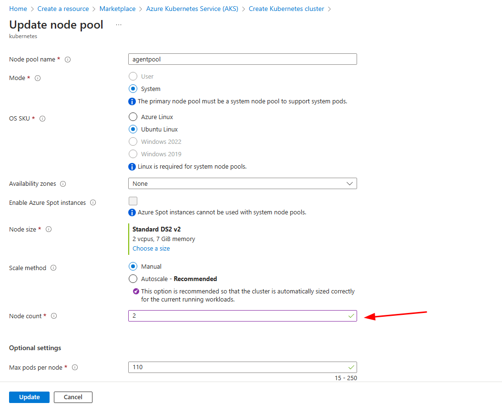

After updating the number of nodes, you can click on "Update".
Now you can click on "Review + create" and then "Create" !

You should now have a kubernetes cluster running on Azure !

Now we'll need to get the `kubeconfig` file to connect to the cluster. Open again the Azure Cloud Shell and run the following command:

```bash
az aks get-credentials --resource-group whanos-rg --name k8s
```

You should get an output like this:

```bash
Merged "k8s" as current context in /home/USERNAME/.kube/config
```

Get the file and store it temporarily, we'll need it later.
You can cat the file to see the content, you should see something like this:

```yaml
apiVersion: v1
clusters:
- cluster:
    certificate-authority-data: REDACTED
    server: https://k8s-dns-1xgwiut.hcp.superregion.azmk8s.io:443
  name: k8s
contexts:
- context:
    cluster: k8s
    user: clusterUser_whanos_rg_k8s
  name: k8s
current-context: k8s
kind: Config
preferences: {}
users:
- name: clusterUser_whanos_rg_k8s
  user:
    client-certificate-data: REDACTED
    client-key-data: REDACTED
    token: REDACTED
```

### Configure the project

First go to `ansible/group_vars/all.yml` and update the variables with the values you got from the previous steps.

```yaml
registry:
registry_user:
registry_password:
```

`registry` should be the URL of the registry.  
`registry_user` should be the username you used to push images to the registry (the one you used to generate the token).
`registry_password` should be the password you used to push images to the registry (one of the two generated).

Then create the file `ansible/production/hosts` with the following content:

```ini
[jenkins]
YOUR_VM_IP ansible_ssh_user=YOUR_VM_USERNAME ansible_ssh_private_key_file=PATH_TO_YOUR_SSH_KEY
```

The VM IP is the public IP of the VM you created.  
The VM username is the username you used to connect to the VM.  
The path to the SSH key is the path to the private key you used to connect to the VM.

It should look like this:

```ini
[jenkins]
192.168.187.52 ansible_ssh_user=azureuser ansible_ssh_private_key_file=~/Downloads/whanos_key.pem
```

Now, provide the `kubeconfig` file to the project.  
Paste the content of `~/.kube/config` copied earlier in the file `ansible/roles/jenkins/files/kubeconfig`.

Finally, you must set the Admin user password for Jenkins.  
Go to `ansible/roles/jenkins/vars/main.yml` and set the password in the variable `jenkins_admin_password`.

> [!NOTE]
> To store any critical information as passwords, you can use Ansible Vault.  
> See the [official documentation](https://docs.ansible.com/ansible/latest/user_guide/vault.html) for more information.

### Deploy the project

You need to have Ansible installed on your machine.  
You don't have it ? You can install it by following the [official documentation](https://docs.ansible.com/ansible/latest/installation_guide/intro_installation.html).

Now you can deploy the project by running the following command:

```bash
ansible-playbook -i ansible/production ansible/playbook.yml
```

> [!NOTE]
> If you use a password to connect to the VM, you can use the `--ask-pass` flag to provide the password.  
> And pass the `--ask-become-pass` flag to provide the sudo password.  
> If you use passwordless sudo, you can skip the `--ask-become-pass` flag, but you'll need to have the `NOPASSWD` option in the sudoers file.

> [!NOTE]
> If you use a ansible vault, provide the `--ask-vault-pass` flag to provide the vault password.  
> And pass the `--vault-password-file` flag to provide the path to the vault password file.  
> (see the [official documentation](https://docs.ansible.com/ansible/latest/user_guide/vault.html) for more information)

Now go grad a coffee ☕, it'll take some time to deploy the project.

If everything went well, you should be able to access the Jenkins server by going to the public IP of the VM on port 80 !!

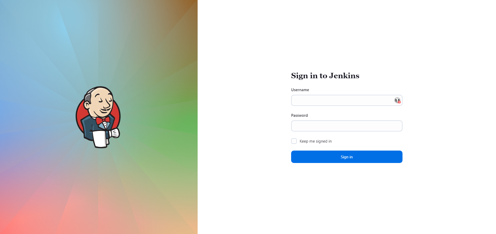

Now connect with the username `admin` and the password you set earlier.

If you want to now more about how to use our Jenkins server, you can go to the [Jenkins documentation](/docs/jenkins.md).

By adding it you'll be able to see it under the "Projects" folder in Jenkins.

You can see how to push a supported project in the [Projects documentation](/docs/projects.md).
