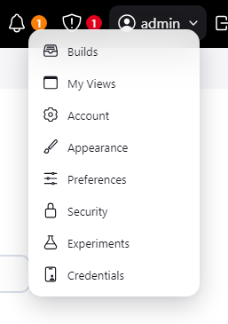
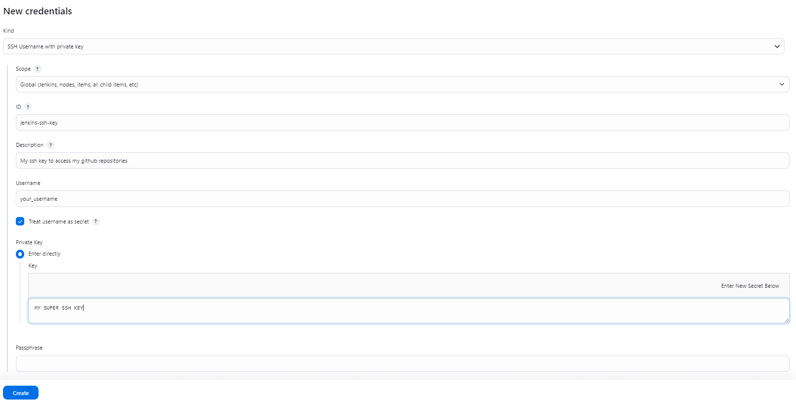

# Set jenkins credentials

Click on Preferences > Credentials > System > Global credentials (unrestricted) > Add Credentials  
From here you can add a new credential.

In this example we will add a ssh key credential that is allowed in our gihub repository.

Now you now how to add a credential to Jenkins!
